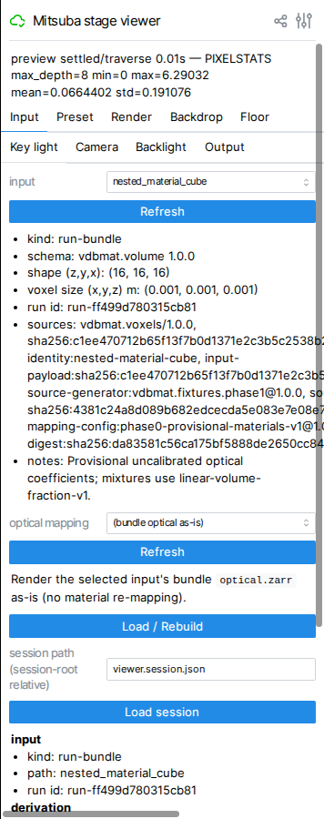
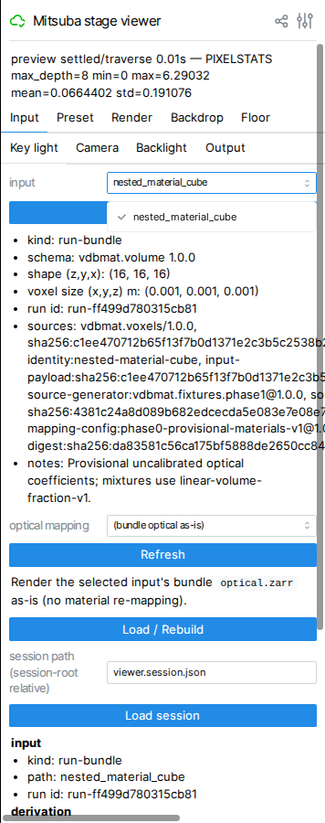
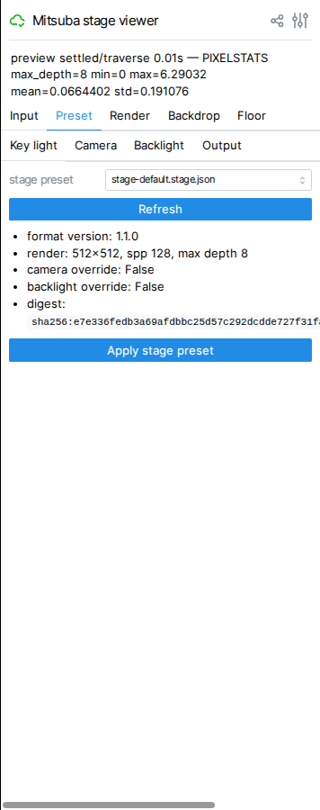
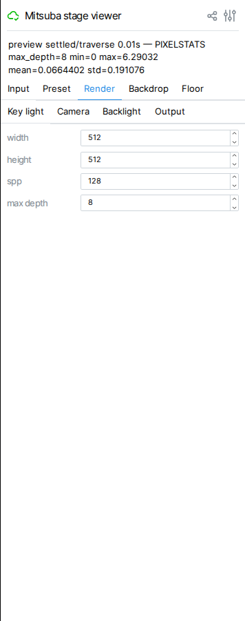
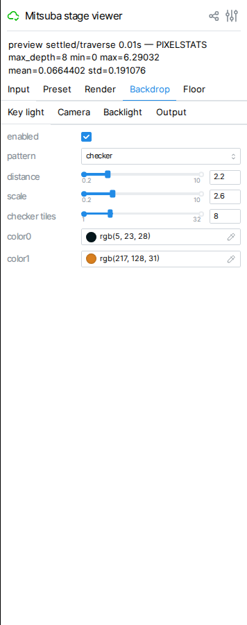
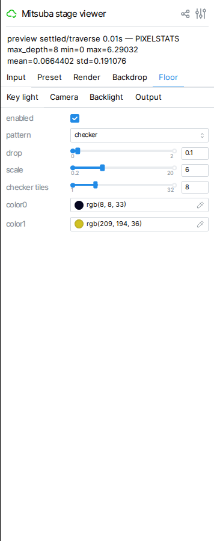
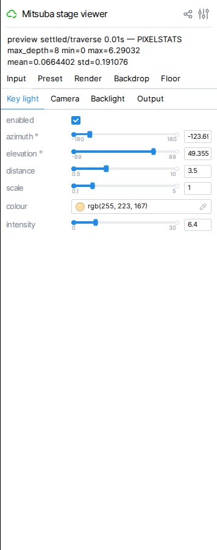
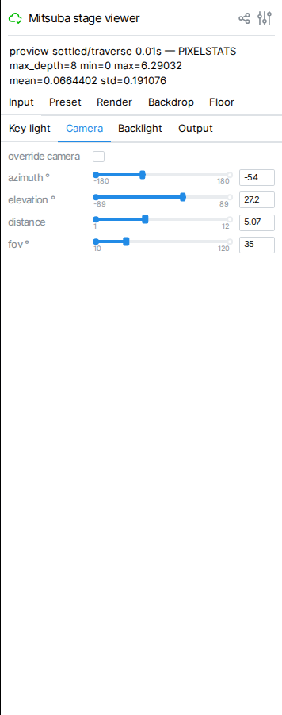
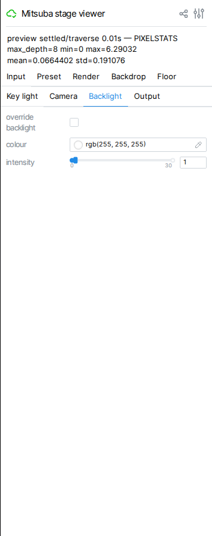
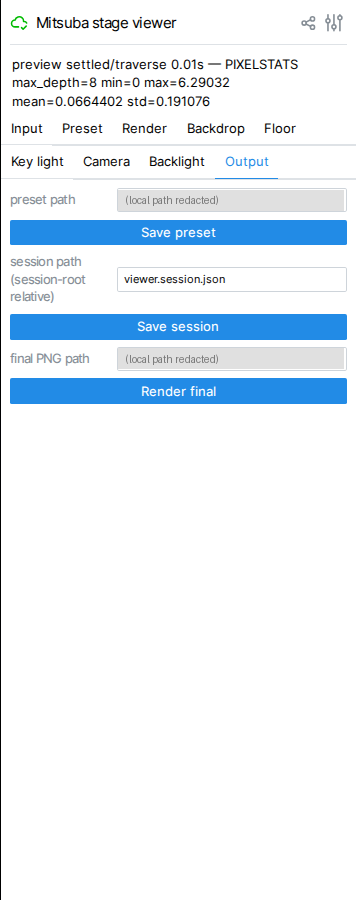

# Stage Viewer GUI Manual

> This manual is generated from screenshots captured by
> `examples/pipeline_run/demo/tools/mitsuba_gui_capture.py`. If the viewer's
> GUI changes (new/renamed tabs or widgets), re-run that script, then
> regenerate this manual by giving an agent
> `.devdocs/function/gui_image_export/manual_prompt.md` plus the new capture
> directory. Do not hand-edit around a stale screenshot — re-capture
> instead.

This page documents the **GUI panel** of `mitsuba_stage_viewer.py` — what
tabs exist, what each widget does, and what order to click things in. It
does not cover optical-mapping schema, digest/provenance semantics, or
pipeline internals; see `README_QUICK.md` and
`.devdocs/vision/mitsubagui_improve/roadmap.md` for those. Viewport (3D
render) content is out of scope for this manual — the screenshots below may
show a low-resolution placeholder render, not a representative final image.

## 1. Launching the viewer

```bash
cd vdbmat
uv run --group mitsuba-viewer python \
  examples/pipeline_run/demo/mitsuba_stage_viewer.py -- \
  .local/blender_improve1/nested_material_cube/optical.zarr \
  --input-root .local/blender_improve1 \
  --stage-config examples/pipeline_run/demo/presets/stage-highkey.stage.json \
  --work-dir ../.local/mitsuba_gui/viewer \
  --interactive-spp 4 --preview-spp 16 \
  --variant cuda_ad_rgb \
  --port 8080
# then open http://127.0.0.1:8080
```

The process prints `viewer ready: http://127.0.0.1:PORT (work dir: ...)`
once the GUI is reachable — this can take anywhere from a few seconds to a
few minutes on a cold start, since Mitsuba JIT-compiles the render kernel
the first time a given variant runs.

## 2. Screen layout



The control panel is a single fixed-width column on the right of the
browser window:

- **Title and status line** at the top (`Mitsuba stage viewer`, then a
  status line such as `preview settled/traverse 0.01s — PIXELSTATS
  max_depth=8 min=0 max=6.29032 mean=0.0664402 std=0.191076`). See
  [section 5](#5-reading-viewer-status) for how to read this line.
- **Tab strip**, wrapped across two rows: `Input`, `Preset`, `Render`,
  `Backdrop`, `Floor`, `Key light`, `Camera`, `Backlight`, `Output`.
- **Per-tab body** below the tab strip, scrollable independently of the
  viewport.

The 3D viewport fills the rest of the browser window to the left of this
panel and is not covered by this manual.

## 3. Tab reference

### Input


Selects and rebuilds the scene's input data. Widgets, top to bottom:

- **input** — dropdown of catalog candidates found under `--input-root`,
  plus **Refresh** to re-scan the directory.
- A read-only summary of the selected candidate: `kind`, `schema`, `shape
  (z,y,x)`, `voxel size (x,y,z) m`, `run id`, `sources` (provenance digest
  chain), and free-text `notes`.
- **optical mapping** — dropdown of `*.optical-mapping.json` candidates
  found under `--mapping-root`, plus its own **Refresh**. The line below it
  states in plain text whether the current selection re-maps materials or
  renders the bundle's `optical.zarr` as-is.
- **Load / Rebuild** — the only button that actually rebuilds the scene.
- **session path** (session-root relative) and **Load session**.
- An **Effective state** panel: `input`, `derivation`, `stage`, `render`,
  `mitsuba` (variant/seed), and `digests`, plus a **Verify digests** button.

Opening the input dropdown shows the candidate list inline:



Per README_QUICK.md: *"Changing the dropdown or clicking Refresh only
updates the selection/catalog; neither action rebuilds the scene."* Only
**Load / Rebuild** validates and prepares the candidate (in a new per-input
work directory), loads it, and performs a smoke render before swapping the
live session. If any stage fails, the status names the failing stage, and
the current scene, preview, and stage/render settings (including
`max_depth`) remain in use.

### Preset


- **stage preset** — dropdown of `*.stage.json` candidates found under
  `--preset-root`, plus **Refresh**.
- A read-only summary: `format version`, `render` (resolution/spp/max
  depth), `camera override`, `backlight override`, `digest`.
- **Apply stage preset** — the only button that actually applies the
  selection.

Selecting a candidate without applying it just updates the summary:



As with Input, selecting a dropdown entry does not by itself change the
live stage — **Apply stage preset** does.

### Render



Four number inputs: **width**, **height**, **spp**, **max depth**. These
are render-transport settings; changing `max depth` triggers a scene
rebuild (Mitsuba does not expose it through live traversal), while the
others take effect on the next render pass.

Below max depth is a **denoise (OptiX)** checkbox (default off). When
checked, `mi.OptixDenoiser` is applied to the final render and to the
settled preview (never to the low-spp interactive preview, to keep drag-time
responsiveness unaffected); PIXELSTATS is always computed from the raw
(pre-denoise) image, and a final render additionally writes that raw image
as `<output stem>.raw<suffix>` next to the denoised PNG. This checkbox is
disabled unless the viewer itself was started with `--variant cuda_ad_rgb`
(OptiX is CUDA-only); its hover hint states this. See "Reduce Noise with
OptiX Denoising" in `README_QUICK.md` for when to reach for it and its
reproducibility caveat (denoised output is only a close match, even on the
same GPU/driver — OptiX has small run-to-run nondeterminism; the raw
sidecar is exactly reproducible). The
screenshot above predates this checkbox; it is a `gui_image_export`
recapture target.

### Backdrop



**enabled** checkbox, **pattern** dropdown (`checker`/`solid`), **distance**
and **scale** sliders, **checker tiles** slider, and two colour pickers
(**color0**, **color1**).

### Floor



Same shape as Backdrop: **enabled**, **pattern**, **drop** and **scale**
sliders, **checker tiles**, **color0**/**color1**.

### Key light



**enabled** checkbox, **azimuth °** / **elevation °** sliders (direction),
**distance** and **scale** sliders, a **colour** picker plus **intensity**
slider (radiance is decomposed into colour × intensity in the GUI only —
the saved preset stores the underlying radiance value untouched if you
never touch these controls).

### Camera



**override camera** checkbox, then **azimuth °**, **elevation °**,
**distance**, **fov °** sliders. These only take effect while the override
checkbox is enabled.

### Backlight



**override backlight** checkbox, a **colour** picker, and an **intensity**
slider.

### Output



- **preset path** and **Save preset**.
- **session path** (session-root relative) and **Save session**.
- **final PNG path** and **Render final**.

The path text fields default to locations under the viewer's `--work-dir`;
this manual's screenshot has those two path fields redacted since they show
a local absolute filesystem path in a real run (see the image-intake rule
in `manual_prompt.md`) — the field labels and button layout are otherwise
unmodified.

## 4. Representative workflow

1. Open the **Input** tab, choose a candidate from the **input** dropdown
   (and optionally an **optical mapping** candidate), and click
   **Load / Rebuild**.
2. Open the **Render** tab and adjust **max depth** (or resolution/spp) to
   compare — each change to `max depth` triggers a scene rebuild.
3. Tune **Backdrop**, **Floor**, **Key light**, **Camera**, and/or
   **Backlight** as needed; the preview updates live.
4. Open the **Output** tab, set a **final PNG path**, and click
   **Render final** to produce the durable, pixel-reproducible output. Use
   **Save preset** / **Save session** alongside it to keep the exact
   settings that produced that PNG.

## 5. Reading viewer status

The status line at the top of the panel (visible in every screenshot in
this manual) follows the format:

```text
<preview state> — PIXELSTATS max_depth=<N> min=<v> max=<v> mean=<v> std=<v>
```

`<preview state>` describes whether the last preview render is
`settled`/interactive and how it was produced (`traverse` for a live
parameter update, or the current Load/Rebuild stage word — `validate →
map → prepare → load → smoke → swap`/`commit` — while a rebuild is in
progress, shown with the just-completed stage's duration in parentheses).
`PIXELSTATS` reports summary statistics of the current preview image, not
the final render. Any failure before `swap`/`commit` leaves the current
session, preview, and GUI settings exactly as they were; the status line
names the stage that failed. See "Operations: Staying in Control During
Day-to-Day Use" in `README_QUICK.md` for the full stage-word table (mapped
to the roadmap's stage names) and the matching `STAGE <transaction> <stage>
<elapsed_s>` stdout log.
